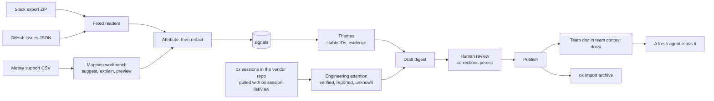

# Customer Pulse: design

> **Everything in the demo is fictional.** Bivo, its customers, their messages, the GitHub
> issues, the support tickets, and the Bivo codebase are invented for this project. No real
> customer data is used anywhere.

Status: draft for review, written in the first session (2026-09-27). The facts about `ox` in
section 14 were checked against ox 0.18.0 on that date. Session 1b (2026-09-28) updated
sections 4, 5, 8, 9, and 14 to 16 for the foundation repairs after Codex's review, and again
after Codex's re-review. Session 3 (2026-09-28) updated sections 4 to 6, 12, and 16 for the
readers, attribution, redaction, and vendor messages.

## 1. The problem

A software vendor's customer feedback is scattered across shared Slack channels, GitHub
issues, and support tickets. The people who fix things (engineers, and more and more their
coding agents) rarely see it in one place, and when they do it is a pile of messages, not a
picture of which workflows are breaking for whom.

Customer Pulse turns that feedback into an **evidence-backed friction digest**. A person
reviews the draft. The reviewed findings are then published into SageOx, so a coding agent
knows what customers are struggling with before it touches the code.

**Audience:** one software vendor's forward-deployed or engineering team, tracking how several
customers experience its product. It is not a tool for an enterprise studying its own
internal workflows.

**Each finding answers:**

1. What was the customer trying to do?
2. Where did the workflow break?
3. Which customers are affected, based on identifiable evidence?
4. What is already tracked or being worked on?
5. What changed since the previous digest?
6. What would help next?

## 2. How it works

| Source | What it contributes | What not to assume |
|---|---|---|
| Shared Slack channels (export ZIP, one channel per customer) | What customers try to do, where they get stuck, workarounds, urgency | That many messages means many affected customers |
| GitHub issues and comments (`gh issue list --json …` output) | Tracked problems, reproduction details, status, close dates | That a closed issue means the customer's problem is solved |
| A messy support-ticket CSV, through the mapping workbench | More customer evidence, and a bounded example of messy input | That an arbitrary file reveals workflow problems without context |
| ox sessions in the vendor's repo | Possibly related engineering activity: which code areas a session changed, verified through its commits | That a session means a fix shipped, worked, or addressed the customer's problem |

Slack and GitHub have known formats, so they get fixed readers with no LLM involved. The
**mapping workbench** handles CSV files whose shape isn't known in advance: it suggests
column-to-field mappings with a confidence and a reason, explains validation failures in
plain language grouped by cause, previews the corrected output before writing anything, and
saves the approved mapping. A later export with the same header fingerprint reuses that
mapping without the LLM, but every row is still validated again.

## 3. Design principles

1. **Themes keep stable IDs** (`th_0007`). "What changed since the last digest" depends on it.
   New signals are matched to existing themes before any new theme is created, and a person's
   corrections are pinned so they survive re-runs. This is the core technical problem.
2. **Code computes facts; the LLM doesn't.** Counts, affected customers, dates, links, trends,
   and the "reported after issue closure" flag come from code. The model only proposes
   groupings, titles, summaries, and next steps. Each statement in the digest is labelled
   **Observed**, **Inferred**, or **Suggested** according to where its data came from, not the
   model's wording. A count computed by code can still rest on model-proposed groupings, so
   the digest shows how many underlying assignments a person confirmed and how many the model
   proposed.
3. **A mention isn't a report.** A message containing an issue URL or `#142` only
   *references* that issue ("this looks unrelated to #142" references it too). Whether a
   message *reports* the same problem is a separate relationship. The model may propose it
   with a confidence, and it counts only after a person confirms it.
4. **Customer text is untrusted twice:** going into the LLM, and going into agents' context.
   Contact details and secrets are redacted before any LLM call and before publishing. Quotes
   stay inside clearly marked evidence blocks. Pulse publishes a team **doc**, never a team
   rule, because ox treats rules as instructions to agents.
5. **Pulse never cites itself.** Everything Pulse publishes is tagged as Pulse output and
   excluded from evidence. A session that only read the digest is not engineering attention.
6. **Engineering attention never marks a theme resolved.** At most it shows possibly related
   engineering activity.
7. **A person reviews before anything is published,** and their corrections persist.
8. **Prove the loop rather than claim it.** Being listed at `ox agent prime` isn't proof: the
   agent decides whether to read the doc. The demo shows, with `ox session view --context`,
   that a fresh agent actually read and used the findings.
9. **No information from the future.** Every digest has an explicit window and cutoff in a
   configured timezone, stored in UTC. Nothing after the cutoff can influence it: not
   messages, not later thread replies, not issue state changes, not engineering sessions.

## 4. Storage

SQLite through Python's built-in `sqlite3`, in one local file that stays out of git. Plain SQL
with numbered migrations (`src/customer_pulse/migrations/0001_initial.sql`, …) recorded in
`schema_migrations`, so a later move to PostgreSQL stays cheap. A shipped migration is never
edited: Pulse refuses a database whose applied migrations changed after they were applied, so
every fix is a new migration (`0002` to `0005` came from Codex's reviews, and `0006` records
who wrote each signal). **SQLite is the
single source of truth**, including the theme registry and the corrections log. The one
committed derivative is the replay file (section 7).

| Table | One row per | Key columns and notes |
|---|---|---|
| `accounts` | customer | `account_id` (`acct_morrowvale`), name, Slack channel id and name |
| `account_domains` | email domain | `domain` → `account_id`; used to attribute CSV tickets |
| `imports` | import batch | source, file name, `content_sha256` (a file's hash identifies the batch, not the evidence in it; an unzipped Slack export's hash covers every file's path and content), time, new/updated/unchanged counts, mapping used |
| `signals` | Slack message, issue comment, or ticket | unique `(source, source_key)`; `account_id` (null = unattributed); author name; `author_role` (`customer` or `vendor`, section 6); `occurred_at` (UTC); **redacted** text; hash of the raw text; URL; thread key; issue number for comments; `is_pulse_output`; first and last import |
| `signal_revisions` | change to an existing record | old and new raw-text hash, import, time; edits are stored deliberately, never silently overwritten |
| `issues` | GitHub issue | number, title, redacted body, URL, author, `created_at`, first and last import; its state lives in `issue_observations` |
| `issue_observations` | issue × import | state, `stateReason`, `closed_at`, labels as exported; history, never updated or deleted |
| `themes` | theme | stable `theme_id`, title, summary, status (`active`, `merged`, `retired`), `merged_into`, `split_from`, whether a person pinned the title |
| `code_areas` | code area of the vendor repo | `area_key` (`wearable_sync`), description |
| `code_area_paths` | path prefix of a code area | area, repo-relative path prefix (`bivo/wearable_sync/`) |
| `theme_code_areas` | theme × code area | set by `model` or `person`; lets the attention view match changed files to themes in SQL |
| `assignments` | signal → theme decision | set by `model` or `person`, confidence, short rationale, run, correction; a person's assignment always wins |
| `links` | signal → issue relationship | `references` (found by code) or `reports` (proposed by the model with a confidence; `proposed`, `confirmed`, or `rejected`) |
| `corrections` | review command | append-only log of the command and its arguments, replayable |
| `sessions` | ox session in the vendor repo | name, repo id, start and stop, URL, agent, produced commits, when reconciled |
| `session_evidence` | session × file | path, level (`verified` or `reported`), commit SHA; a file with no row is `unknown`; history, and no rows can be added once a run has used the session |
| `runs` | pipeline run | kind, mode (`live`, `replay`, or `offline`), window, cutoff, timezone, model, effort, prompt version, tokens, cost; the window and cutoff are fixed, and a run finishes once |
| `run_imports` | run × import | the imports in the run's evidence snapshot; recorded only while the run is running, then fixed (section 5) |
| `run_sessions` | run × engineering session | the sessions in the run's evidence snapshot, under the same rules |
| `digests` | digest version | `digest_id` (`dg_0003`), run (which holds the window and cutoff), previous digest, content, `content_sha256`, status (`draft`, `approved`, `published`, `superseded`), approved hash; the lifecycle is in section 9 |
| `publish_events` | publishing attempt | digest, step (`doc_written`, `doc_pushed`, `doc_listed`, `archived`), status (`done`, `failed`, `blocked`), approved hash, and the proof: doc hash, team-context commit, listing session, or archive reference; append-only (section 9) |
| `mappings` | approved CSV mapping | header fingerprint (unique), mapping, approval |
| `llm_cache` | LLM request | hash of the complete request → validated response, the request as sent (redacted text only), token usage |

**Views compute the facts:** the effective assignment per signal; per run and theme, the
signal and thread counts, affected customers (distinct non-null accounts), unattributed
count, confirmed versus proposed assignments, and first and last seen inside the window; the
trend against the previous digest; each issue's state at the cutoff; confirmed `reports` links
dated after the linked issue closed (with its `stateReason`); and each theme's engineering
attention. Run-scoped views join through `runs`, because SQLite views can't take parameters,
and read only the run's evidence snapshot (section 5).

| Views | What they give |
|---|---|
| `v_theme_resolution`, `v_theme_unresolved` | each theme's surviving theme after merges; the second must always be empty |
| `v_effective_assignment` | each signal's current theme, with a person's assignment winning |
| `v_run_signals`, `v_run_theme_facts`, `v_run_theme_customers`, `v_digest_theme_trend` | a run's signals and per-theme facts, and the trend against the previous digest |
| `v_run_issue_observations`, `v_run_issue_closures`, `v_run_issue_state` | what the run's snapshot saw of each issue, and its state at the cutoff |
| `v_run_reported_after_closure`, `v_run_theme_attention` | the closure flag and engineering attention, per run |
| `v_publish_steps`, `v_last_published_doc` | the latest event per publishing step, and the document of the latest successful push |
| `v_issue_latest` | each issue's latest observation, for status output only; no run reads it |

**The schema enforces the invariants itself,** so a bug in later code fails loudly instead of
corrupting evidence (decisions [0007](docs/decisions/0007-enforce-invariants-in-the-schema.md) and
[0010](docs/decisions/0010-bind-every-run-to-an-evidence-snapshot.md)). All tables are STRICT, and:
- **Timestamps:** every one must have the fixed-width UTC shape.
- **Runs:** a run's cutoff must sit inside its window. The window and cutoff are fixed, a run
  finishes once, and its evidence snapshot is recorded only while it runs.
- **Evidence:** issue observations and session evidence are history. Signals, issues, and
  runs are kept, and so is a session once a run has used it. A signal's identity, time,
  customer, author role, thread, issue, and first import are fixed, and so is an issue's creation time;
  only a signal's text can be revised. Once a run has used a session, its evidence and times
  are fixed.
- **History:** corrections and assignments are append-only, enforced by triggers.
- **Mentions and reports:** a `references` link can never be reviewed into a claim, and a
  `reports` link needs a logged correction to be confirmed or rejected.
- **Digests:** a digest is created as an unapproved draft, and its status only moves forward.
  Approval happens only as a draft becomes approved, it is final, and the approved hash must
  equal the content hash. A digest is frozen once it leaves draft, and kept.
- **Publishing:** events are append-only and need an approved digest's approved hash. Every
  success carries its proof, a push must match a written document and a listing a pushed one,
  and a digest is `published` only after a successful push.
- **Themes:** a theme merges only into an active theme, merges and split lineage are final,
  and themes are kept, so a merge cycle can't form.
- **Evidence levels:** `verified` evidence must name its commit.
- **Migrations:** a migration stops rather than drop existing records or accept a broken
  state, such as a merge cycle already in the database.
- **Replacement:** SQLite's REPLACE deletes the row it replaces without firing UPDATE
  triggers, so every connection enables recursive triggers to make it fire the DELETE guards,
  and every table guarded against UPDATE also guards DELETE. A test checks the second rule.
  Re-imports update rows in place, with an UPDATE or an upsert (decision
  [0007](docs/decisions/0007-enforce-invariants-in-the-schema.md)'s second amendment).

**Local state is private.** The database holds customers' words, so Pulse creates the state
directory as 0700 and the database file as 0600 before SQLite opens it. Existing state that
other users can read is refused with the exact `chmod` to run. Pulse never changes
permissions itself. It also refuses a database or companion path that is a symbolic link or
isn't a regular file, before opening anything, so it never follows a link out of the state
directory. `pulse status` reports all of these without changing anything (decision
[0005](docs/decisions/0005-privacy-gates-before-storage-model-calls-and-publishing.md)'s
amendments).

**Failures come back in the same format as results.** With `--json`, a failure is a JSON error
with a stable code and a hint; without it, the same message goes to stderr. Expected
filesystem and SQLite failures have their own codes: `state_path_not_a_directory`,
`state_dir_not_private`, `database_not_private`, `database_path_not_regular`,
`permission_denied`, `filesystem_error`, `database_locked`, `database_unavailable`,
`database_unreadable`, and `database_error`.
Programming errors still raise, so a bug can't hide behind a tidy message. Every connection
waits up to five seconds (`LOCK_WAIT_SECONDS`) for another command's lock.

The doorbell queue from the kickoff is gone (section 10), so nothing lives outside SQLite
except the replay file and the log. The log, `pulse.log` in the state directory, is one JSON
event per line: event names, file names, IDs, and counts, never customer text. It is created
0600, never followed through a link, and refused like the database if other users can read
it. The check happens before any import writes, so a refusal leaves the database untouched.

## 5. Record identity, windows, and time

Every source record has a stable identity, and re-importing overlapping exports updates
records instead of duplicating them:

| Record | Identity |
|---|---|
| Slack message | channel id + `ts`. Every message gets a thread key: its parent's `thread_ts`, or its own `ts`, so a message that gains replies in a later export keeps its thread |
| GitHub issue | issue number |
| GitHub comment | the comment `id` from `gh` output |
| CSV ticket | the ticket-ID column when the mapping finds one; otherwise a hash of the normalized row. Rows without an ID can't be matched across edited exports |
| Import batch | SHA-256 of the file content (for an unzipped Slack export, of every file's path and content). The same batch again changes nothing |

**Re-importing.** A record Pulse hasn't seen is added. One whose raw text is unchanged only
notes the later import. One whose raw text changed is revised: its old redacted text goes to
`signal_revisions`. Everything else a run relies on is fixed at the first import (decision
[0010](docs/decisions/0010-bind-every-run-to-an-evidence-snapshot.md)). If a later import
would attribute a record differently, the first attribution stays and the import says how
many records that affected. An import that would change fixed evidence, such as an issue's
creation time, fails as a whole with `evidence_conflict`. Each GitHub import adds one
observation per issue.

**Windows and cutoffs.** A digest covers `[start, end)` in the configured timezone, stored in
UTC. The cutoff defaults to the window end. When the model reads a thread, the thread stops
at the cutoff too, because "still broken" means nothing without its thread, and a reply
written later must not leak in. Engineering sessions count only when their stop time and
commits fall before the cutoff. Tests run on a fixed clock.

**Evidence snapshots.** Each run records the imports and engineering sessions it used, and
every run-scoped view reads only that snapshot, so a later export can't change the facts of a
run that already exists. Later exports feed new runs, including earlier facts they reveal
(decision [0010](docs/decisions/0010-bind-every-run-to-an-evidence-snapshot.md)). An issue's
state at the cutoff comes from the snapshot's observations in import order:

| State | When |
|---|---|
| `open` | no observation shows a closure before the cutoff |
| `closed` | the latest observation that shows one isn't contradicted by a later observation |
| `unknown` | a later observation shows the issue reopened, or closed on another date; the export has no reopen history, so the change can't be placed relative to the cutoff |

Only issues created before the cutoff have a state. Labels at the cutoff are unknown for the
same reason: each observation records the labels as exported.

These rules hold from the very first digest. Boundary tests are written with the thin slice,
before anything is published: the window edges, a thread reply after the cutoff, an issue
closed after the cutoff, a session after the cutoff, and a later import that must not change
an earlier run.

## 6. Attribution and redaction

Order matters: **parse → attribute → redact → store.** Attribution can use email domains, so
it happens before redaction.

- **Slack:** the shared channel names the customer. In a channel that names no customer, a
  customer author's email domain may, matched against `account_domains`; the address comes
  from the export's `users.json` and is never stored (decision
  [0011](docs/decisions/0011-vendor-messages-are-context-and-slack-falls-back-to-email-domains.md)).
- **CSV:** an account column, or the requester's email domain matched against
  `account_domains`.
- **GitHub:** authors stay unattributed unless a mapping names them.
- Evidence that can't be attributed is **counted as unattributed, never guessed**.

The customer list comes from `pulse accounts load <file>`: each account's ID, name, shared
Slack channel, and email domains. The first Slack export that shows a customer's channel
records its ID. Loading never removes an account or a domain, and a domain or channel belongs
to one account.

**Vendor staff.** Shared channels and issue threads carry the vendor's replies too. Pulse
stores them, because a thread read without its replies loses its meaning, but marks them
`author_role = 'vendor'`, and `v_run_signals` leaves them out, so no fact counts them. Slack
staff are recognised by `vendor.slack_team_ids` or `vendor.email_domains` in `pulse.toml`, and
GitHub staff by `authorAssociation` (`OWNER`, `MEMBER`, `COLLABORATOR`). An import without a
`[vendor]` section warns that staff replies will count.

Redaction uses patterns, never an LLM (`redact.py`): email addresses, phone numbers with 9 to
15 digits, and secrets. Secrets are recognised by shape (JWTs, `*_live_*` and `sk-` keys,
GitHub, Slack, and AWS tokens, private-key blocks) or by label (`Bearer …`, `api_key=…`,
`password: …`, where the label is kept). Each match becomes a marker such as
`[redacted email]`, so the evidence stays readable. Slack markup is rendered first
(`<mailto:…|…>` becomes the address, `<@U…>` the person's name), so the patterns see what a
person would. People's names are kept, so readers know who reported or decided what. Only redacted text is
stored, sent to the model, or published, and generated text is redacted again before
publishing. If a real customer's data agreement ever forbade sending names to an LLM, stable
aliases would be the fallback; that is noted here, not built.

**Privacy gates.** No live model call happens until tests prove that attribution by email
domain works while no raw email address, phone number, or token reaches any SQLite text
column, log, cache entry, or captured model request. Prompt-injection text is different: it is
real evidence (one planted case depends on it), so it is stored and sent only inside
delimited evidence blocks, and the typed output schema keeps it from steering the result.
Nothing is published until a test proves that generated text containing a contact detail is
redacted first.

The stored-data gate is in place (session 3, `tests/test_privacy_gate.py`). After every thin
fixture is imported, from folders and ZIPs, no planted contact detail, token, or key appears
anywhere in the database file or the log, byte for byte, and no text column holds anything
the patterns would catch. The injection line is stored only in one message's text, quoted as
the customer wrote it. A mutation check confirmed the gate fails when redaction is switched
off.

## 7. The LLM boundary

- **Provider:** Claude only, through Anthropic's official Python SDK. Every call goes through
  one small module that returns validated, typed results. Tests use a fake and never touch
  the network.
- **Model:** the kickoff sets `claude-opus-5` at `effort: high` for every task (grouping,
  digest writing, mapping suggestions, validation explanations), kept in config. The model ID
  and parameters will be confirmed against the `claude-api` skill or Anthropic's documentation
  when the module is written, not from memory. The real cost is reported after the first full
  run.
- **Key:** read from `ANTHROPIC_API_KEY`. If it isn't set, an interactive terminal gets a
  hidden prompt that keeps the key in memory for that run only (never written, logged, or
  echoed) plus instructions for setting the variable. A non-interactive run exits with a
  message saying what to set.
- **Replay mode:** each saved response is keyed by a hash of the complete request: model,
  effort, prompt and schema version, and the full rendered input, including the current
  themes and any approved mapping. Changing any of those needs a key. The demo's responses
  are exported to a committed replay file so anyone can run the demo on the committed inputs
  without a key. Replay output is labelled as replay. Replay proves reproducibility, not model
  quality.

## 8. Themes, links, and the digest

**Themes.** The model sees the current themes (IDs, titles, summaries, a little evidence) and
assigns new signals to them, proposing a new theme only when nothing fits. Signals a person
has assigned are pinned and never re-assigned by the model. `merge` keeps the surviving ID and
records `merged_into`; `split` keeps the original ID for what remains and mints new IDs for the
parts that leave. A theme merges only into an active theme, and merges and split lineage are
final, so merges can never form a cycle. Themes are never deleted; one that stops being useful
is retired. Resolution follows merge chains to any depth. Before the first publish, tests
with a fake model run grouping several times and check that the same inputs keep the same
theme IDs, new signals join existing themes, a person's assignment survives a re-run and
wins, and merges and splits keep their lineage.

**Links.** Code finds `references` (issue URLs, `#142`, `owner/repo#142`). The model may
propose `reports`, with a confidence. A `reports` link supports a claim about an issue only
after a person confirms it.

**Reported after issue closure.** A customer report dated after a specific issue closed, where
a *confirmed* `reports` link ties them together. The report must fall inside the digest window,
before its cutoff; the closure only has to come before the report, so an issue closed last
week and reported again this week is flagged. The closure comes from the run's evidence
snapshot; when the snapshot holds several, the flag shows the latest one before the report
(decision [0004](docs/decisions/0004-flag-re-reports-even-when-the-closure-precedes-the-window.md)).
The digest shows the issue's `stateReason` (`completed` or `not_planned`) beside the flag and
never calls it a regression, which would need evidence about releases or earlier working
behaviour.

**The digest** leads with the top themes. Each carries:
- the user goal and the break point
- affected customers and the unattributed count
- the evidence as quoted, redacted text in marked blocks
- tracked issues (confirmed `reports`) separated from mere mentions
- the closure flag
- what changed since the previous digest
- possibly related engineering activity
- suggested next steps

Every statement is labelled Observed, Inferred, or Suggested.

## 9. Review, approval, and publishing

**Review** happens through CLI commands:

- `pulse review`
- `pulse theme move | merge | split | rename`
- `pulse link confirm | reject`

Every command is written to `corrections` and can be replayed. Regenerating a draft re-applies
the stored corrections, so review work is never lost. `pulse review --approve` records the
approved digest's content hash; any change makes a new draft that needs review, and
`pulse publish` refuses anything that isn't approved. Approval is final. A digest is created as
a draft, its status only moves forward (draft, approved, published, and any of them to
superseded), and it is frozen once it leaves draft. Tests cover the negative cases:
publishing an unapproved digest is refused; so is content changed after approval;
regenerating identical content keeps the approval; and a resumed publish re-checks the exact
approved hash at every step. Every command supports `--json`.

**Tier 1: the team doc.** One file, `docs/customer-friction.md`, at the top level of the team
context's `docs/`. Only top-level files there are cataloged. Pulse overwrites it on each
publish:

- **Contents:** the top themes only, roughly 1,000 to 2,000 tokens, with a pointer to the
  archive and the line "current as of <date>, digest <id>".
- **Catalog row:** prime shows agents only the **filename and the `when:` text**, so `when:`
  names the affected code areas and task types. Limits: `when` 500 characters, `title` 100,
  `description` 160.
- **Pulse owns the file.** Before overwriting it, Pulse compares it with what it last
  published and stops to ask if someone else changed it.

Publishing order. The write, commit, and push path was verified in the first session; the
ownership rules came from the plan review.

1. `ox sync`.
2. The ownership check: the doc in the checkout must be exactly what Pulse last published.
3. Write the file.
4. Commit inside the team-context checkout.
5. Before every push, check ownership again, against the doc in the *parent* of Pulse's
   commit. The daemon pulls team context on its own every 15 seconds, so a foreign edit can
   arrive after step 2. Pushes are fast-forward only, so a parent that holds exactly what
   Pulse last published means no one else's edit can be overwritten.
6. `git push`, never force.
7. If the push is rejected, run `ox sync` (the daemon pulls and rebases under its own
   per-clone lock), repeat step 5, and push once more. A raw `git pull --rebase` here would
   race the daemon's fetch: ox's own incident review of 2026-09-02 found that concurrent
   fetches on one clone corrupt `FETCH_HEAD`.
8. If an ownership check fails, the retry sync can't rebase cleanly, or the second push is
   rejected, Pulse drops its own unpushed commit, leaves the other edit in place, records
   the step, and stops to ask. It never resolves a conflict in the team doc.
9. Confirm the remote `main` equals the local commit.
10. Prove the listing with a **fresh** agent session's start-up prime. Pulse never re-runs
    `ox agent prime` inside a session.

**Tier 2: the archive.** `ox import` of each dated, reviewed digest:

- The title is `Customer Pulse digest <id> (<date>)`.
- It is filed with `--date`.
- Imports have no update or delete command, so they happen only with an explicit OK each
  time, never in development or tests.
- The unique title also avoids ox's same-date directory collision (imports are stored under
  `data/docs/<date>/<slug>`).

`publish_events` logs every attempt at `doc_written`, `doc_pushed`, `doc_listed`, and
`archived` per digest version, and events are never changed:
- Each success carries its proof: the document hash, the team-context commit, the session
  that listed the doc, or the archive reference.
- A push must carry the hash of a document written for the digest, and a listing the hash of
  a pushed one.
- The latest event per step shows where a partial success stopped, so a retry resumes there.
- "What Pulse last published", which the ownership checks compare against, is the document of
  the latest successful push by event order, so no edit to history can change it (decision
  [0003](docs/decisions/0003-publish-with-sync-first-and-parent-checked-pushes.md)'s amendment).

## 10. Engineering attention

**Pull, not push.** Each `pulse digest` and `pulse status` run reconciles sessions from ox's
history by running `ox session list --json` and `ox session view <name> --json` with the
vendor repo as the working directory, plus `git` in the vendor repo. The working directory
matters: `ox session list --repo <path>` still merges the *current* directory's ledger.
`pulse status` reports how many new engineering sessions arrived since the last digest.

**No doorbell hook in v1.** The kickoff planned a `session.uploaded` hook as a doorbell. In
ox 0.18.0 that event is emitted only from a daemon IPC handler that nothing sends to, and has
been since hooks shipped in #491, so it never fires. The user chose to drop the hook from v1;
a clean-repro upstream issue will be drafted for them to file.

**Evidence levels, per session and theme:**

| Level | Meaning |
|---|---|
| **Verified** | Commits the session produced (its `SageOx-Session:` trailer, or `ProducedCommits`; the trailer wins when they disagree) changed files in the theme's code area, read from git with their diffs. |
| **Reported** | The transcript shows write or edit actions on those files but no linked commit. Labelled unverified. |
| **Unknown** | Not enough evidence either way. A file that was only read or mentioned doesn't count. |

Even verified changes mean *possibly related* engineering activity, never that the session
addressed the customer's problem. Sessions that only read the digest don't count.

**Preflight on a real Bivo session.** Before any reconciliation code depends on it, a check
script runs from Bivo's working directory against a real, finished Bivo session. It proves
five things:
- the session is visible once uploaded
- its commit trailer resolves to it
- git gives its changed files
- its transcript exposes write and edit actions with paths
- DigestOx sessions never appear in Bivo's list, and Bivo's never appear in DigestOx's

`scripts/ox_preflight.py` implements it (session 2). A trailer resolves when the session ID it
names appears in the session's `ox session view --json --metadata`. Ox 0.18.0 does not expose
that remote ID in local metadata, so the preflight also reads the recorded commit output in
the same session. The changed files are the paths git lists for that commit. The transcript
check needs a write or edit action on one of those files. For Codex's `functions.exec` shape,
it decodes escaped patch newlines and recovers `apply_patch` file markers. An uploaded session
can arrive as a stub, so the preflight downloads it once (`ox session download`) before
reading it. On 2026-09-28 it passed all five checks against a real Bivo session.

**Open for session 8: mapping a trailer to its session.** The evidence levels above assume
Pulse can tell which session a commit's trailer names. Ox 0.18.0's session JSON doesn't carry
that ID, and the preflight's fallback, a commit and trailer shown in the session's own
recorded git output, would also match a session that merely printed another session's
commit. Session 8 decides between that fallback bounded by the session's start and end times,
a documented ox source for the ID or the produced commits, and the upstream request drafted in
session 2.

## 11. Evaluation

- **Answers kept apart.** The correct answers (each record's theme and links) live in a
  separate evaluation manifest keyed by record ID. Nothing in ingestion, grouping, linking, or
  any LLM call may read it, and a test enforces this.
- **Held-out week.** Prompts are tuned on week 1 only. Week 2 is generated once, with prompts
  and settings frozen, and the results are saved.
- **`pulse eval`** scores saved results offline, so re-scoring costs nothing:
  - **Grouping:** pairwise precision and recall over record pairs, because theme IDs are
    arbitrary.
  - **Links:** precision and recall over (record, issue, relationship) triples.
  - **Continuity:** whether week-2 records join the correct week-1 themes instead of creating
    duplicates.
  - Scores are reported before and after human correction.
- **Determinism test.** The fixtures, the replay file, and a scripted list of corrections, run
  against an empty database with a fixed clock and stable ordering, must produce an identical
  digest every time. The test compares digest content, not run IDs, timestamps, or live
  session state.
- **The limit:** the same agent wrote the data and the prompts, so these numbers are a
  regression check, not a claim about real-world quality.

## 12. The demo: Bivo (fictional)

**Bivo** is a B2B platform that gym chains and coaching studios use to give their members
AI-generated training and nutrition plans. Its customers talk to Bivo in shared Slack
channels, one per customer.

| Customer (fictional) | Profile | Slack channel | Domain |
|---|---|---|---|
| Morrowvale Athletic Clubs | regional gym chain, about 40 clubs | `#bivo-morrowvale` | `morrowvale.example` |
| Copperfen Fitness | gym chain, about 12 sites | `#bivo-copperfen` | `copperfen.example` |
| Kettlewren Coaching | three coaching studios | `#bivo-kettlewren` | `kettlewren.example` |
| Brackenlight Strength | one strength studio | `#bivo-brackenlight` | `brackenlight.example` |

Web searches on 2026-09-27 found no business using these names.

**Bivo's codebase** is a small, invented Python repo with one module per code area:
- member roster import
- wearable sync
- the plan engine
- coach tools
- SSO

It lives at `~/Workbench/bivo-platform`, local only: no GitHub remote, never pushed. It is set
up with `ox init` in the same SageOx team as this repo, so its session recordings sync to the
team while its commits stay on this machine.

Each code area is a package (`bivo/wearable_sync/`, …) with `router.py`, `schemas.py`, and
`service.py`, and its tests sit in the matching `tests/` folder. So each code area is exactly
two path prefixes, `bivo/<area>/` and `tests/<area>/`, which is what `code_area_paths` expects.
`bivo/api/` assembles the routers, and `bivo/worker/` runs wearable sync outside the request
path. The code uses only the standard library.

**Conventions borrowed from TraceRoot.** To feel like a real startup's repo, Bivo borrows
engineering conventions from TraceRoot's open-source repository (`traceroot-ai/traceroot`,
Apache-2.0 outside its `ee/` directories, reviewed at commit `d786ae7`):
- a REST layer split into routers, schemas, and services, with a separate background worker
- GitHub issue forms (environment, steps to reproduce, expected and actual behaviour, logs,
  version) that shape the synthetic issue bodies
- a label taxonomy (type, `P0` to `P3` priority, and per-area labels)
- a contributing guide and agent instructions
- an agent lint hook on edits

These are patterns, not copies. If a file is ever adapted, the vendor repo's `NOTICE` records
it. Nothing is taken from `ee/`, TraceRoot's name is not used, its real issues and
contributors are not reproduced, and its agent setting `bypassPermissions` is deliberately not
adopted.

**Fixtures.** GitHub issue URLs use `https://github.com/bivo-fictional/bivo-platform/issues/<n>`.
That owner doesn't exist on GitHub (checked 2026-09-27), and the URLs are not meant to
resolve. Every other email address and web URL uses an `.example` domain. The fictional notice
lives in `fixtures/README.md` and the fixture manifest, not inside the data files, which stay
valid in their native formats.

**Thin fixtures** (`fixtures/thin/`, session 3) cover one week, 14 to 20 September 2026: two
overlapping Slack exports, two `gh issue list` snapshots, the customer list, and a manifest
of planted cases, written by `scripts/build_thin_fixtures.py`. Dhananjay reviewed them before
any reader was built on them.

**Planted cases** (all in the full dataset; the thin fixtures carry most of them):
- the same failed workflow reported by three customers across five threads
- the same problem reported in both Slack and the CSV
- a message that could belong to either of two themes (corrected in review)
- a closed issue reported again afterwards by a customer message that links to it
- a message that mentions an issue without reporting it
- a message that can't be attributed to any customer
- a customer message containing a prompt-injection line, which must stay quoted evidence
- Pulse's own previous digest in team context, which must not count as evidence

A small check script confirms every planted case is present.

Bivo's code carries one planted defect, for session 7's fresh agent to find from the customer
symptom: wearable sync fetches only the first page of a provider's workouts, at most 50, and
then advances the member's sync time, so on a busy day the rest never arrive. Its tests pass,
because they cover single-page syncs only.

## 13. Decisions

**Settled:**
- Python with uv (installed 2026-09-27).
- Package `customer-pulse`, imported as `customer_pulse`; command `pulse`; CLI framework
  Typer; MIT licence.
- The CLI is the only interface; every command supports `--json`. No REST API or web server.
- SQLite as described above.
- Claude only, with replay mode.
- CLI review commands.
- Both publishing tiers, only after review.
- Pull-based engineering attention, with no hook in v1.
- The demo vendor, customers, and fixture URLs above.
- About 150 Slack messages, 25 GitHub issues with comments, and 60 support tickets over two
  consecutive weeks.
- Local commits are fine. Pushing, issues or PRs, `ox import`, writing to team context,
  murmurs, invites, and publishing skills need an explicit OK each time.

**Out of scope for v1:** a REST API or web server, live Slack or GitHub connections, OAuth,
multiple tenants, dashboards, health or churn scores, scheduling, automatic publishing,
automatic issue creation or customer replies, and PDFs or other arbitrary documents.

**Open (ask when reached):**
1. Stretch goals: a murmur when a theme spikes (scoped with `--files` to the theme's code
   paths, `critical` kept for regressions), and publishing Pulse as a team skill.
2. The model ID, to be confirmed as described in section 7.

## 14. Verified ox facts (0.18.0, commit `f52d5c94`, checked 2026-09-27)

`main` (`c7a76ab`) was two commits ahead and touched none of these files. Paths are in
`github.com/sageox/ox`.

| Area | What holds on 0.18.0 | Source | Versus the kickoff |
|---|---|---|---|
| Hook config | User-level `~/.config/sageox/hooks.yaml`; the event arrives as JSON on stdin; commands run through `sh -c` in their own process group; SIGTERM at 500 ms, SIGKILL at 1 s; stdout and stderr discarded; at most 4 at once | `internal/daemon/hooks/runner.go`, `runner_unix.go`, `config.go` | Confirmed |
| Hook environment | Sanitized: `HOME`, `PATH`, `TMPDIR`, `XDG_*`, and ox's own `OX_*` protocol variables, plus `OX_EVENT` and `OX_EVENT_TIMESTAMP` | `internal/envutil/env.go`; live test | Slightly more than "only `OX_EVENT` and `OX_EVENT_TIMESTAMP`"; still no secrets |
| Duplicate hooks | `ox hooks add` appends, but loading de-duplicates on (event, command), so a duplicate never runs twice. `add` rewrites the file and drops invalid entries | `hooks/config.go` | Refined |
| Testing hooks | `ox hooks test <event>` runs hooks inside the CLI with payload `{"test": true}`, project `/tmp/ox-hooks-test`, repo `repo_test`. The synthetic timestamp is the zero time `0001-01-01T00:00:00Z` | `cmd/ox/hooks_events_test_cmd.go`; live test | Confirmed; timestamp bug found |
| Installing hooks | The daemon reads `hooks.yaml` only when it starts; one daemon per workspace, chosen by the working directory; no remove command | `internal/daemon/daemon.go:1173`, `config.go` | Confirmed |
| Events that fire | `daemon.started`, `daemon.stopped`, `sync.completed` (after every ledger pull, every 60 s), `sync.failed`, `murmur.received`, `murmur.critical`. Never emitted: `session.started`, `session.stopped`, `session.available`, `agent.registered`, `agent.idle` | `daemon.go`, `sync.go`, `murmur_relay.go` | Confirmed |
| `session.uploaded` | Emitted only by the daemon's handler for an IPC message that nothing sends, since #491. The CLI uploads the session itself and notifies sageox.ai over HTTP instead | `ipc_handlers.go:455`, `cmd/ox/agent_session.go`, `session_linkage_finalize.go` | **Changed: never fires** |
| Session upload | `ox agent session stop` copies the transcript, writes `meta.json` (with `ProducedCommits`), uploads to LFS, and commits and pushes the ledger itself; the daemon isn't required. The daemon exits after an hour of inactivity | `cmd/ox/agent_session.go`, `internal/daemon/config.go` | New |
| Team docs | Only top-level `docs/*.md` in team context; `README.md` and unfilled scaffold docs are skipped; `visibility: hidden` is skipped; `always` is treated as `indexed`. Prime's catalog shows only the filename and `when` | `internal/teamdocs/discover.go`, `cmd/ox/agent_prime_xml.go` | Refined |
| Team docs documentation | The seeded team-context `docs/README.md` documents the folder and its frontmatter limits, though the ox guide's layout doesn't list it | team-context `docs/README.md`, `cmd/ox/guides/team-context.md` | Partly changed |
| Writing to team context | Direct edits are committed and pushed from inside the checkout. The daemon's team-context sync is **pull-only**, so it never pushes a local commit | `guides/team-context.md`, `internal/daemon/sync_team.go` | Changed: Pulse must push, with the retry in section 9 |
| Sync race | Per-clone advisory lock (ADR-030) around the daemon's git operations; raw git in the clone doesn't take it | `internal/gitutil/repolock.go`, COE 2026-09-02 | New |
| `ox import` | De-duplicates by content hash (`--force` re-imports); also refuses a second import into the same `data/docs/<date>/<slug>`; `--date`, `--title`, `--text`; no update or delete | `cmd/ox/import.go` | Refined (stored under `data/docs/`, not `documents/`) |
| Reading sessions | `ox session list --json`; `ox session view <name> --json`; `--context` shows the context trace; `--repo <path>` merges the current directory's ledger | `ox session view --help`, `ox session list --help` | Refined |
| Sessions and commits | `prepare-commit-msg` adds the `SageOx-Session:` trailer; `post-commit` and `post-rewrite` maintain `ProducedCommits`; the trailer wins on disagreement; squash merges lose it | `docs/specs/session-commit-linkage.md` | Confirmed |
| `ox doctor` | Even without flags it starts the daemon and applies checks marked `FixLevelAuto`, which can include an automatic "stop tracking ox-managed agent files" commit. `--force-session-uploads` and `--gc` also make changes | `cmd/ox/doctor.go`, `doctor_types.go`, `doctor_legacy_ox_files.go` | **Changed: not read-only** |
| `ox agent prime` | Reads hook JSON from stdin and waits if stdin is an open pipe (run it with `</dev/null`). A second prime in the same agent session is a compact re-prime without the team-docs catalog. In the first session, a re-prime started a new recording for the same agent. In session 1b, Claude Code's context compaction re-ran prime through its SessionStart hook, which finalized and uploaded the running recording (20h 35m, 517 entries) and started a new one | live, sessions 1 and 1b | New |
| `ox init` | Skips an existing project `.claude/settings.json`, installing none of its six Claude Code hooks while reporting success; `ox integrate list` then shows Claude Code as not integrated. Merging the hooks by hand fixes it. Codex and git hooks install either way | live, session 2 | **New: upstream draft written** |
| Trailers across repos | `ox hooks commit-msg` takes the recording that is active in the committing repo: commits made in Bivo from a DigestOx session carry no `SageOx-Session:` trailer | live, session 2 | New |
| Uploaded sessions | `ox session view <name>` reported "not found" for an uploaded session. Its help says sessions can arrive as metadata-only stubs, and `ox session download <name>` fetches their content. The Bivo session was already hydrated, so the download path is still unexercised | live, session 2 | New |
| Session IDs | Neither `ox session list --json` (name, status, title, summary, entry count, hydration) nor `ox session view --json --metadata` (agent ID and type, user, repo ID, creation time) carries the `ses_…` ID that commit trailers name | live, session 2 | **New: upstream draft written** |

**Live tests in the first session:**

| Test | Result |
|---|---|
| Hook runner | A stdlib script accepted both payload shapes directly (about 44 ms) and through `ox hooks test` (25 ms). It was then removed by deleting `hooks.yaml`, which didn't exist before. |
| Team-doc publishing path | `ox sync` (3 s), write, commit, push (first try), and a remote check passed with a labelled test doc (team-context commits `582c553` and `ad2f49c`). The listing itself remains to be proved with a fresh session. |

## 15. How the design was reached

The idea was brainstormed with ChatGPT and Claude, in an earlier session that ox didn't
record. Both reviews were then checked against the ox source, which corrected several of
their claims (the hook event name, how hook context arrives, which sessions trigger the hook)
and found the team-docs path that neither review mentioned. A second pass found three gaps:
- the doorbell had no reader
- the hook fires for every repo on the machine
- engineering attention needed a verified source of changed files

Two further reviews:
- tightened the evaluation (answers kept apart from inputs, a held-out week scored offline),
  the storage contract, the evidence levels, and the demo
- added record identity, digest cutoffs, and the difference between mentioning an issue and
  reporting it
- found that `ox hooks test` bypasses the daemon, which reads hooks only when it starts

The first recorded session (2026-09-27) re-checked those facts against ox 0.18.0 and changed
the design in four ways:
- `session.uploaded` turned out never to fire, so the doorbell hook was dropped in favour of
  pulling session history.
- The daemon only pulls team context, so Pulse pushes its own commit and retries through
  `ox sync` instead of a raw `git pull --rebase`.
- Prime's catalog shows only the filename and `when:`, so both carry the doc's meaning.
- Re-running prime inside a session proved unsafe, so the listing is proved from a fresh
  session.

An outside review of the first build plan (by ChatGPT) found gaps in the build order, all
adopted:
- the loop needed explicit evidence at every stage
- the time and privacy rules had to be enforced before the first publish and the first live
  model call
- the attention preflight had to use a real Bivo session instead of this repo's
- approval needed negative tests
- theme stability had to be tested before anything was published

A second round corrected two rules. Pulse syncs before checking ownership and repeats the
check before every push. And a re-report is flagged even when the issue closed before the
digest window.

Codex's review of the foundation build (`95fc080`) reproduced six gaps. Session 1b fixed all
six, with new migrations and CLI changes, before session 2:
- Approval could be cleared or forged. It is now final, and status only moves forward.
- A later issue import rewrote an earlier run's facts. Each run now reads only its evidence
  snapshot.
- A merge cycle silently removed themes and their evidence. Cycles are now impossible.
- Publishing proof was incomplete and could be reordered. It is now an append-only event log.
- Filesystem and database failures escaped the JSON output. They now have stable error codes.
- An existing readable state directory exposed the database. Such state is now refused.

Codex's re-review confirmed the six repairs and found two adversarial bypasses, which it fixed
in `ca5cadd`. SQLite's `INSERT OR REPLACE` could rewrite approval and publishing history, and a
dangling database symlink escaped the privacy check. Reviewing that fix found the same
replacement gap in three more tables, plus an issue creation time that nothing guarded, and
migration `0005` closed them.

The vendor was nearly swapped for TraceRoot, a real open-source startup. The decision was to
keep the fictional Bivo, so that invented complaints never attach to a real company, and to
borrow TraceRoot's open-source engineering conventions instead.

## 16. Limits and growth path

- The evaluation is a regression check, not evidence of real-world quality (section 11).
- CSV rows without an ID can't be matched across edited exports.
- Exports are assumed to arrive in the order they were taken. An older Slack export imported
  after a newer one revises an edited message back to its older text; both versions stay in
  `signal_revisions`.
- Redaction can't catch a secret with no recognisable shape or label, or a phone number with
  fewer than nine digits.
- A Slack ZIP is read into memory, which suits exports of a few customers' channels.
- A run's issue state is `unknown` when its snapshot can't place a reopen relative to the
  cutoff, because GitHub's export has no reopen history.
- Local state is protected by POSIX permissions. On other systems Pulse can't check them.
- The replacement guard depends on recursive triggers, which Pulse turns on for its own
  connections. A connection opened another way, such as the `sqlite3` shell, could still
  replace rows.
- Pulse depends on ox's CLI output and team-context layout, which change often. It pins the
  version it was checked against (above), parses JSON defensively, and fails loudly.
- **Growth path:** PostgreSQL, when several FDEs write at once, Pulse becomes a hosted
  service, or Slack is ingested live. The plain-SQL migrations keep that move cheap. None of
  it is built now.
